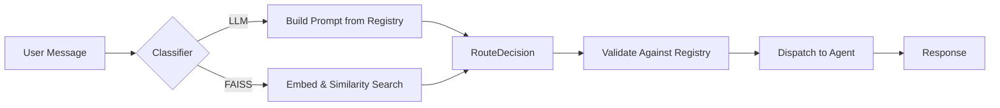

# agent-registry-router

[](https://github.com/agibson22/agent-registry-router/actions/workflows/ci.yml)
[](https://pypi.org/project/agent-registry-router/)
[](https://pypi.org/project/agent-registry-router/)
[](LICENSE)

Registry-driven LLM routing: build classifier prompts, validate decisions, and dispatch to the right agent.

## Why

When you have multiple AI agents, something needs to decide which one handles each user message. Most teams hardcode `if/else` chains or build bespoke classifiers. This library gives you a clean, framework-agnostic way to:

- **Build classifier prompts** from a registry of agent descriptions
- **Validate routing decisions** with typed errors (no silent fallbacks)
- **Dispatch** to the selected agent with observability hooks
- **Benchmark** classifier accuracy across LLMs and embedding models

## How It Works



## Install

```bash
pip install agent-registry-router
```

With a framework adapter:

```bash
pip install "agent-registry-router[pydanticai]"    # PydanticAI
pip install "agent-registry-router[openai-agents]"  # OpenAI Agents SDK
pip install "agent-registry-router[google-adk]"     # Google ADK
pip install "agent-registry-router[faiss]"          # FAISS classifier
```

## Quick Start

```python
from agent_registry_router.core import (
    AgentRegistry,
    AgentRegistration,
    RouteDecision,
    build_classifier_system_prompt,
    validate_route_decision,
)

# Register your agents
registry = AgentRegistry()
registry.register(AgentRegistration(name="billing", description="Handles billing and payments."))
registry.register(AgentRegistration(name="technical", description="Handles technical support."))
registry.register(AgentRegistration(name="general", description="Handles general inquiries."))

# Build a classifier prompt from the registry
prompt = build_classifier_system_prompt(registry, default_agent="general")

# Validate a routing decision
decision = RouteDecision(agent="billing", confidence=0.9, reasoning="Payment question.")
validated = validate_route_decision(decision, registry=registry, default_agent="general")
```

## Adapters

Framework-specific dispatchers that handle classify → validate → dispatch. Each is opt-in — the core has no framework dependencies.

| Adapter | Install Extra | Dispatcher Class |
|---------|--------------|-----------------|
| PydanticAI | `pydanticai` | `PydanticAIDispatcher` |
| OpenAI Agents SDK | `openai-agents` | `OpenAIAgentsDispatcher` |
| Google ADK | `google-adk` | `GoogleADKDispatcher` |

All adapters are duck-typed (no runtime imports of the framework). Any object matching the protocol works. All support:

- `route_and_run()` — classify, validate, dispatch
- `route_and_stream()` — same flow, streaming output
- Pinned agent bypass (skip classifier, dispatch directly)
- `on_event` observability hooks

```python
from agent_registry_router.adapters.pydantic_ai import PydanticAIDispatcher
from agent_registry_router.adapters.openai_agents import OpenAIAgentsDispatcher
from agent_registry_router.adapters.google_adk import GoogleADKDispatcher
```

## FAISS Classifier

An alternative to LLM-based classification: embed agent descriptions, find the nearest match by cosine similarity. Near-zero latency, near-zero cost.

```python
from agent_registry_router.core import FaissClassifier

classifier = FaissClassifier(
    registry=registry,
    embed_fn=your_embedding_function,  # any callable: list[str] -> list[list[float]]
)
decision = classifier.classify("I was charged twice")
```

## Structured Logging

Built-in JSON logging for routing events. One line to set up.

```python
from agent_registry_router.core import StructuredLogger

dispatcher = PydanticAIDispatcher(
    ...,
    on_event=StructuredLogger(),
)
# Produces: {"ts": "...", "event": "classifier_run_success", "agent": "billing", "confidence": 0.92}
```

## Eval Suite

Benchmarks the classifier prompts this library generates across LLMs and FAISS. Includes fixtures, a runner, and a report generator.

```bash
make install-eval
cp .env.example .env  # add your API keys
make eval
```

See [`evals/README.md`](evals/README.md) for details. Bring your own fixtures to benchmark your own agent registries.

## Error Handling

Fail-fast with typed exceptions — no silent fallbacks.

- `InvalidRouteDecision` — classifier picked a non-routable agent
- `InvalidFallback` — default agent isn't routable or registry is empty
- `AgentNotFound` — validated agent can't be resolved for dispatch
- `RegistryError` — invalid names, descriptions, or empty registry

## Design Principles

- **Framework-agnostic core**: routing logic has no opinion on your agent framework
- **Duck-typed adapters**: protocols, not imports — any compatible object works
- **Fail-fast validation**: typed errors, never silent wrong-agent routing
- **Deterministic prompts**: registration order preserved, routable-only, size-bounded
- **Observable**: `on_event` hooks + `StructuredLogger` for production monitoring

## Development

```bash
make install       # install dev dependencies
make lint          # ruff + black + mypy
make test          # pytest with 85% coverage gate
make format        # auto-format
make eval          # run classifier benchmarks (requires API keys)
```

## License

Apache-2.0
